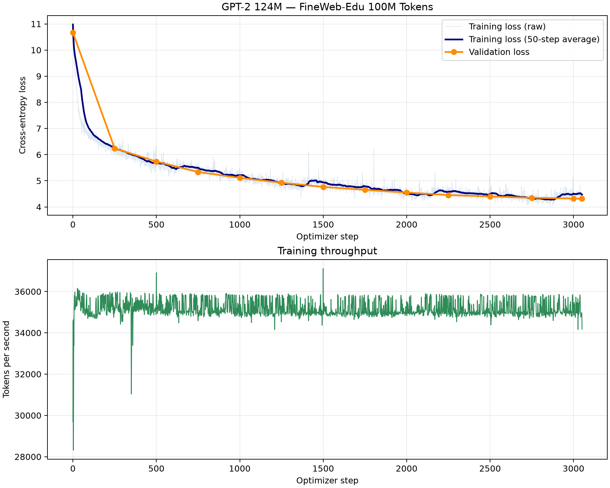

# GPT-2 From Scratch on 100M FineWeb-Edu Tokens

A from-scratch implementation and single-GPU training reproduction of the GPT-2 architecture, inspired by Andrej Karpathy's [build-nanogpt](https://github.com/karpathy/build-nanogpt).

The project implements the model, training pipeline, data preparation, evaluation, checkpointing, and autoregressive text generation in PyTorch. A GPT-2 Small–style model was trained from random initialization on approximately 100 million FineWeb-Edu tokens using a single NVIDIA GeForce RTX 5080.

## Project scope

This is a small-scale training reproduction intended to verify and study the complete GPT-2 pretraining pipeline.

It is not a reproduction of OpenAI's original WebText training run or official GPT-2 benchmark results. The original full WebText dataset is not publicly available, and this experiment uses substantially fewer tokens than a full GPT-2 pretraining run.

## Results

| Item | Result |
|---|---:|
| Architecture | GPT-2 Small |
| Parameters | Approximately 124.5M |
| Transformer layers | 12 |
| Attention heads | 12 |
| Embedding dimension | 768 |
| Context length | 256 tokens |
| Training vocabulary | 50,304 |
| Training data | FineWeb-Edu |
| Training tokens | 100,007,936 |
| Validation tokens | 5,000,000 |
| Optimizer steps | 3,052 |
| Global batch size | 32,768 tokens |
| Precision | BF16 |
| GPU | NVIDIA GeForce RTX 5080 |
| Final training loss | 4.2922 |
| Final validation loss | 4.3133 |
| Throughput | Approximately 34K–36K tokens/s |

The training and validation losses remained close at the end of the run, with no obvious sign of severe overfitting.

## Training curves



The raw training loss varies between batches because each batch contains different web documents. The moving average provides a clearer view of the overall optimization trend.

## Generation samples

The following samples were generated from the final `step_003052.pt` checkpoint with:

- Temperature: 0.8
- Top-K: 50
- Fixed random seeds

### Prompt: `Hello, I'm a language model,`

> Hello, I'm a language model, for you're a language model, but you haven't got some good lessons from all over the world. You're a computer-friendly, but you're a good example of how you've got a great job.

### Prompt: `The future of artificial intelligence is`

> The future of artificial intelligence is always so long as to allow the ability to control their own brains. With the help of the new digital revolution in the 21st century, the world's biggest advances in technology are turning to an end of the universe.

### Prompt: `In a small town,`

> In a small town, two of the two people in the city of Saina in the city of Tok, whose family, who had been there in the city of Naina and their families, had been under the command of the city.

These samples demonstrate that the model learned basic English syntax, punctuation, local topic continuation, and common document patterns. The model still exhibits repetition, semantic drift, factual unreliability, and limited long-range coherence, which is expected at this training scale.

Full samples are available in [`results/generation_samples_100m.md`](results/generation_samples_100m.md).

## Implemented components

- GPT configuration
- Token and positional embeddings
- Multi-head causal self-attention
- PyTorch scaled dot-product attention
- Pre-normalized Transformer blocks
- GELU MLP
- Residual connections
- Weight tying
- GPT-2 parameter initialization
- Hugging Face weight compatibility verification
- Autoregressive generation
- Temperature and Top-K sampling
- Memory-mapped token shard loader
- Gradient accumulation
- BF16 mixed-precision training
- AdamW parameter grouping
- Learning-rate warmup and cosine decay
- Gradient clipping
- Validation loop
- CSV training logs
- Checkpoint saving and recovery
- FineWeb-Edu streaming preparation
- Automated tests

## Project structure

```text
gpt2-from-scratch-100m/
├── configs/
│   ├── debug/README.md
│   ├── debug.yaml
│   ├── smoke_100m.yaml
│   └── train_100m.yaml
├── results/
│   ├── generation_samples_100m.md
│   └── training_curves_100m.png
├── scripts/
│   ├── create_debug_data.py
│   ├── generate_checkpoint.py
│   ├── generate_text.py
│   ├── overfit_tiny.py
│   ├── plot_training.py
│   ├── prepare_fineweb.py
│   ├── train.py
│   └── verify_pretrained.py
├── src/
│   ├── data.py
│   ├── model.py
│   └── training.py
├── tests/
│   ├── test_data.py
│   ├── test_model.py
│   └── test_training.py
├── .gitignore
├── LICENSE
├── README.md
└── requirements.txt
```

Data files, downloaded weights, local checkpoints, caches, and training logs are intentionally excluded from Git.

## Installation

Create and activate a Python environment:

```powershell
conda create -n gpt2-from-scratch-100m python=3.11 -y
conda activate gpt2-from-scratch-100m
```

Install the dependencies:

```powershell
python -m pip install -r requirements.txt
```

Verify CUDA:

```powershell
python -c "import torch; print(torch.cuda.is_available()); print(torch.cuda.get_device_name(0)); print(torch.cuda.is_bf16_supported())"
```

## Run the tests

```powershell
pytest -v
```

The tests cover model shapes, causal masking, residual blocks, backpropagation, initialization, weight sharing, generation, data loading, learning-rate scheduling, and optimizer grouping.

## Verify compatibility with official GPT-2 weights

Downloaded weights are stored locally and are not included in this repository.

```powershell
python -m scripts.verify_pretrained
```

This compares the logits from this implementation with the Hugging Face GPT-2 implementation using the same pretrained weights and input tokens.

The official weights are used only for structural verification. The 100M-token experiment starts from randomly initialized parameters.

## Prepare FineWeb-Edu data

Run a small smoke test first:

```powershell
python -m scripts.prepare_fineweb --output-dir data/fineweb_smoke --train-tokens 100000 --val-tokens 10000
```

Prepare the full experiment data:

```powershell
python -m scripts.prepare_fineweb --output-dir data/fineweb_100m --train-tokens 100000000 --val-tokens 5000000
```

The output consists of memory-mapped NumPy token shards:

```text
data/fineweb_100m/
├── train_000000.npy
└── val_000000.npy
```

These files are excluded from Git.

## Train the model

Run the debug configuration first:

```powershell
python -m scripts.train --config configs/debug.yaml
```

Start the full 100M-token experiment:

```powershell
python -m scripts.train --config configs/train_100m.yaml
```

Resume from a trusted local checkpoint:

```powershell
python -m scripts.train --config configs/train_100m.yaml --resume checkpoints/gpt2_100m/step_003000.pt
```

## Generate text

Generate samples from the final trained checkpoint:

```powershell
python -m scripts.generate_checkpoint --checkpoint checkpoints/gpt2_100m/step_003052.pt
```

## Plot training results

```powershell
python -m scripts.plot_training
```

The plot is written to:

```text
results/training_curves_100m.png
```

## Limitations

- The model was trained on approximately 100M tokens, far less than a complete GPT-2 training run.
- The context length was reduced to 256 tokens for a practical single-GPU experiment.
- The generated text has limited factual and long-range coherence.
- No claim is made that this checkpoint matches OpenAI's pretrained GPT-2.
- The experiment focuses on implementation correctness, training behavior, and reproducibility under constrained compute.

## References and acknowledgements

This project was developed while studying:

- Andrej Karpathy, [build-nanogpt](https://github.com/karpathy/build-nanogpt)
- OpenAI, [Language Models are Unsupervised Multitask Learners](https://cdn.openai.com/better-language-models/language_models_are_unsupervised_multitask_learners.pdf)
- Hugging Face, [FineWeb-Edu](https://huggingface.co/datasets/HuggingFaceFW/fineweb-edu)
- Hugging Face, [GPT-2 implementation](https://huggingface.co/docs/transformers/model_doc/gpt2)

The implementation follows the educational progression of `build-nanogpt` and includes additional project structure, tests, configuration files, local checkpoint loading, Windows/RTX 5080 adaptations, a bounded 100M-token data pipeline, and documented experiment results.

## License

This project is released under the MIT License. See [`LICENSE`](LICENSE) for details.

The project includes concepts and implementation patterns derived from Karpathy's MIT-licensed `build-nanogpt`; attribution is retained above.